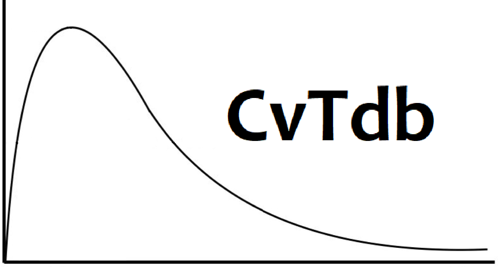

# CompTox-PK-CvTdb

# Background
The Concentration versus Time Database (CvTdb) contains manually curated time-series data and associated metadata for *in vivo* toxicokinetic ("TK") studies on organic chemicals available in the scientific literature. The PostgreSQL database has been developed in close coordination with leading researchers at the EPA with specialties relating to toxicology and toxicokinetic modeling. These data inform chemical safety analysis and allow evaluation of the relationship between administered doses and internal concentrations of a substance. These data can also be used to build or evaluate physiologically based pharmacokinetic (PBPK) and physiologically-based (PBTK) models (such as the [*httk*](https://cran.r-project.org/web/packages/httk/index.html) R package), which simulate the absorption, distribution, metabolism, and elimination of a chemical. The database also contains toxicokinetic parameters, including volume of distribution and elimination half-life, which are calculated across all data associated with a particular compound using the publicly available pharmacokinetic curve-fitting software [*invivoPKfit*](https://CRAN.R-project.org/package=invivoPKfit). This version 2.0.0 release builds upon the original [v1.0.0](https://github.com/USEPA/CompTox-PK-CvTdb/releases/tag/v1.0.0) “legacy” database released with Sayre, Wambaugh, and Grulke (2020) and the minor [v1.1.0](https://github.com/USEPA/CompTox-PK-CvTdb/releases/tag/v1.1.0) database release from 2021 that added the Showa Pharmaceutical University dataset. The code, documentation, and vignettes associated with the database release are available on GitHub ([CompTox-PK-CvTdb](https://github.com/USEPA/CompTox-PK-CvTdb); [CvTdbLoad](https://github.com/USEPA/cvtdbload)). The database is also available for download through the public CCTE EPA [Clowder repository](https://doi.org/10.23645/epacomptox.29610452.v1) (no user account required).

# v2.0.0 Specific Files
Due to file size limitations, the SQL and SQLite files uploaded for v2.0.0 had the "cvt_audit" table removed. This is the database table that tracks all record changes whenever an UPDATE statement is made. This table is instead provided as a `parquet` file. See the [arrow parquet package](https://arrow.apache.org/docs/r/articles/read_write.html) for additional information on how to read these files with R or Python.

# How to Cite CvTdb
- v2.0.0 Dataset
  - Wall, J. T., Rowan, E. G., Huse, L. M., Aboabdo, J., Kesic, B., Casey, W., Correa, V. A., Hermelin, S., Hope, J., Ring, C. L., Wambaugh, J. F., & Sayre, R. R. (2025). Concentration versus Time Database (CvTdb) v2.0.0 Data Release [Data set]. Zenodo. https://doi.org/10.23645/epacomptox.29610452.v1
- 2020 publication:
  - Sayre, R.R., Wambaugh, J.F. & Grulke, C.M. Database of pharmacokinetic time-series data and parameters for 144 environmental chemicals. Sci Data 7, 122 (2020). https://doi.org/10.1038/s41597-020-0455-1 

# Dataset Versioning
Files associated with previous versions of the database described in the publication have been moved to the folder "archive". See [Releases](https://github.com/USEPA/CompTox-PK-CvTdb/releases) to access previous versions.

# Repository Links
- [cvtdbLoad](https://github.com/USEPA/cvtdbload)
- [CompTox-PK-CvTdb](https://github.com/USEPA/CompTox-PK-CvTdb)

# Contribute
If you are interested in contributing or want to report a bug, please submit a issue or start a discussion. See [CONTRIBUTING](https://github.com/USEPA/CvTdbLoad/blob/main/CONTRIBUTING.md) for more information.

# Disclaimer
The United States Environmental Protection Agency (EPA) GitHub project code is provided on an "as is" basis and the user assumes responsibility for its use.  EPA has relinquished control of the information and no longer has responsibility to protect the integrity , confidentiality, or availability of the information.  Any reference to specific commercial products, processes, or services by service mark, trademark, manufacturer, or otherwise, does not constitute or imply their endorsement, recommendation or favoring by EPA.  The EPA seal and logo shall not be used in any manner to imply endorsement of any commercial product or activity by EPA or the United States Government.
