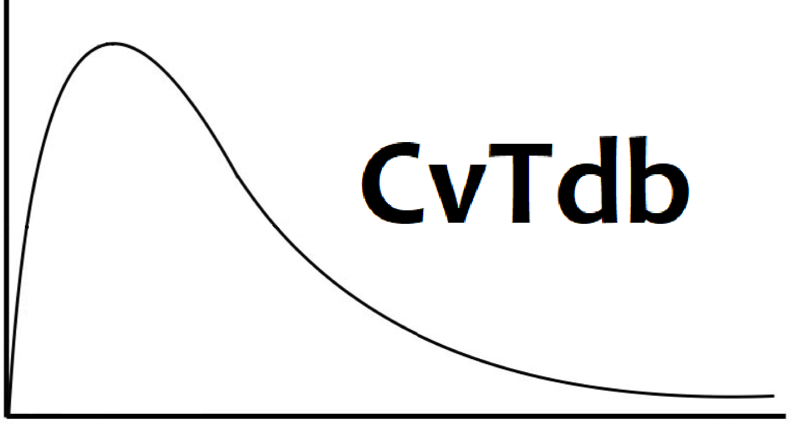

# CompTox-PK-CvTdb

The CvTdb is a database of pharmacokinetic time-series for environmental chemicals. You can build the database on a MySQL server. You can create your own local server following the instructions at https://dev.mysql.com/doc/mysql-getting-started/en/.

Please upload data contributions using the template CvT_data_template.xlsx in this repo. Add underscore, the date (DDMMYYYY), underscore, and your GitHub handle to the filename.

Sayre, R.R., Wambaugh, J.F. & Grulke, C.M. Database of pharmacokinetic time-series data and parameters for 144 environmental chemicals. Sci Data 7, 122 (2020). https://doi.org/10.1038/s41597-020-0455-1
